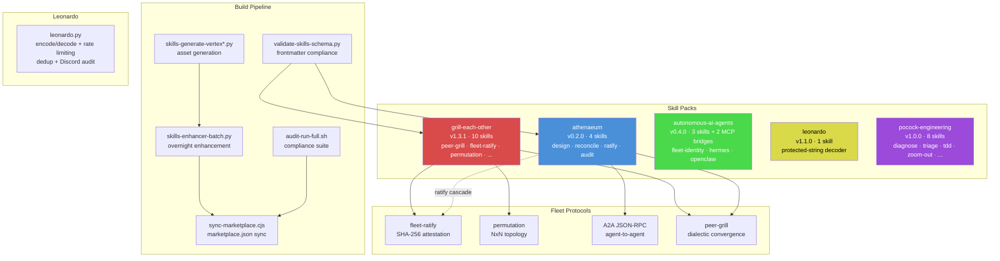
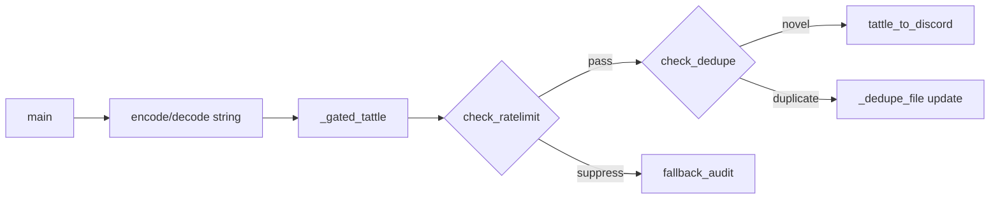
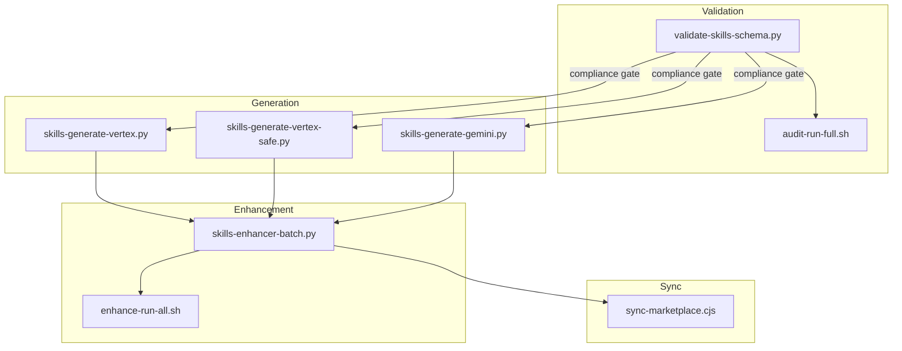
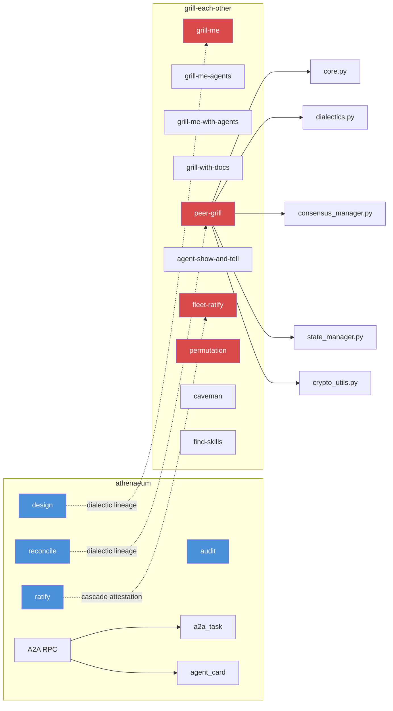

# Dancer Architecture

> Jack Reis's Claude Code skill pack marketplace — 5 packs, 26 skills, zero inherited bloat.

## Overview

Dancer is a monorepo containing **5 curated skill packs** (26 skills total) for Claude Code. Originally forked from an MIT-licensed upstream, all inherited plugins were removed on 2026-05-16. Dancer now ships only original work.

The architecture has four layers:

1. **Skill Packs** — the user-facing units, each a self-contained directory of SKILL.md files, scripts, tests, and assets
2. **Pack Infrastructure** — per-pack package.json, README, REFERENCE.md, and test suites
3. **Build Pipeline** — scripts that validate, generate, enhance, and sync the marketplace
4. **Fleet Protocols** — cross-pack convergence primitives (dialectic, attestation, A2A)



## Functional Areas

### 1. Athenaeum (Convergence Engine)

**Path:** `plugins/skill-enhancers/athenaeum/`
**Skills:** design, reconcile, ratify, audit

A streamlined 4-skill dialectic pipeline for agent convergence:

| Skill | Purpose | Key Artifacts |
|-------|---------|---------------|
| `athenaeum-design` | Propose design claims for peer review | `.athenaeum/design/` claim files |
| `athenaeum-reconcile` | Resolve conflicting claims into merged design | `.athenaeum/reconcile/` session files |
| `athenaeum-ratify` | Fleet-wide formal attestation with dissent recorded | `.athenaeum/ratify/` signed receipts |
| `athenaeum-audit` | 13-branch code-aware agent stack audit | `.athenaeum/audit/` report files |

**Internal modules:**

```
athenaeum/scripts/
├── a2a_rpc.py          # JSON-RPC 2.0 server (HTTP transport for A2A protocol)
├── a2a_task.py         # Task/Artifact/TaskStatus data model + persistence
├── agent_card.py       # Agent Card generator (/.well-known/agent.json)
├── test_a2a_rpc.py     # RPC server tests
├── test_a2a_task.py    # Task model tests
├── test_agent_card.py  # Agent Card tests
└── test_athenaeum.py   # Core 28/28 tests
```

**A2A integration:** The `a2a_rpc.py` module implements the Google A2A (Agent-to-Agent) protocol, exposing `tasks/send`, `tasks/get`, and `tasks/cancel` methods over JSON-RPC 2.0. This bridges athenaeum's file-based convergence protocol to network-accessible agent coordination.

### 2. grill-each-other (Dialectic Claim Discipline)

**Path:** `plugins/skill-enhancers/grill-each-other/`
**Skills:** grill-me, grill-me-agents, grill-me-with-agents, grill-with-docs, peer-grill, peer-grill-with-agents, agent-show-and-tell, fleet-ratify, permutation, dialectic-vocabulary

The full 10-skill dialectic toolkit. Two lineages converge here:

- **Convergence lineage:** grill-me → grill-me-agents → grill-me-with-agents → peer-grill → fleet-ratify
- **Visibility lineage:** agent-show-and-tell (status reports without convergence pressure)

**Core modules:**

```
peer-grill/
├── core.py              # PeerGrillDialectic engine
├── dialectics.py         # Thesis-antithesis-synthesis processor
├── consensus_manager.py # Multi-agent convergence tracker
├── state_manager.py     # ClaimsStateManager for .peer-grill/ state
├── crypto_utils.py       # AttestationManager (SHA-256 signing)
└── scripts/
    ├── peer_grill_check_convergence.py
    ├── peer_grill_diff.py
    ├── peer_grill_fingerprint.py
    ├── peer_grill_grade.py
    ├── peer_grill_init.sh
    └── peer_grill_signoff.py
```

**fleet-ratify** provides SHA-256 attestation with a Python CLI (`fleet_ratify.py`) and 2 e2e tests. It ratifies **artifacts** (nodes).

**permutation** ratifies **relationships** (edges) between agents in NxN topologies, producing Mermaid + ASCII topology diagrams.

### 3. autonomous-ai-agents (Fleet Coordination)

**Path:** `plugins/ai-agency/autonomous-ai-agents/`
**Skills:** fleet-identity, hermes-bridge, openclaw-bridge

Fleet identity and messaging bridges:

| Skill | Purpose |
|-------|---------|
| `fleet-identity` | Declares who an agent is — name, role, capabilities, boundaries |
| `hermes-bridge` | MCP bridge to Hermes messaging relay |
| `openclaw-bridge` | MCP bridge to OpenClaw dispatch system |

### 4. Leonardo (Protected Strings)

**Path:** `plugins/ai-agency/leonardo/`
**Skills:** leonardo (1 skill)

A protected-string decoder with rate limiting, deduplication, and Discord audit trail.

**Execution flow:**



### 5. Pocock Engineering (SDLC Skills)

**Path:** `plugins/skill-enhancers/pocock-engineering/`
**Skills:** zoom-out, diagnose, triage, tdd, to-issues, to-prd, improve-codebase-architecture, setup-matt-pocock-skills

Eight software development lifecycle skills forked from Matt Pocock's framework. These are pure SKILL.md files with no scripts — they rely on Claude Code's native tool invocation.

## Build Pipeline

The `scripts/` directory contains the marketplace maintenance toolchain:



| Script | Purpose |
|--------|---------|
| `validate-skills-schema.py` | Validates SKILL.md frontmatter against 2025 schema |
| `skills-generate-vertex.py` | Generate missing assets using Vertex AI |
| `skills-generate-vertex-safe.py` | Same, with safety wrappers |
| `skills-generate-gemini.py` | Generate missing assets using Gemini |
| `skills-enhancer-batch.py` | Overnight batch enhancement pipeline |
| `skills-enhancer-gcloud.sh` | gcloud CLI wrapper for enhancement |
| `sync-marketplace.cjs` | Synchronizes marketplace.json from plugin state |
| `audit-run-full.sh` | Runs all validation scripts in sequence |

### Pipeline Execution Flows

**Skills Enhancement Pipeline** (`skills-enhancer-batch.py`):
1. `main()` → `run_overnight_batch()` → `process_plugin()`
2. `process_plugin()` → `generate_enhancement_plan()` → `smart_delay()` → `apply_enhancements()`
3. `apply_enhancements()` → `backup_plugin()`

**Skills Generation Pipeline** (`generate-missing-assets.py`):
1. `main()` → `process_all_plugins()` → `process_plugin()` → `generate_asset_content()`
2. `generate_asset_content()` → `build_json_prompt()` / `build_markdown_prompt()` / `build_yaml_prompt()` / `build_html_prompt()`

**Validation Pipeline** (`validate-skills-schema.py`):
1. `main()` → `log_validation_failure()` — reports schema violations for all SKILL.md files

**Leonardo Decoding** (`leonardo.py`):
1. `main()` → `encode_text()` / `decode_filename()` → `encode_string()` / `decode_string()`
2. Output → `_gated_tattle()` → `check_ratelimit()` + `check_dedupe()` → `tattle_to_discord()`

## Cross-Pack Dependencies



**Key relationships:**
- athenaeum-ratify cascades to fleet-ratify for fleet-wide attestation
- athenaeum-reconcile descends from the peer-grill dialectic lineage
- athenaeum-design descends from the grill-me lineage
- A2A RPC depends on a2a_task and agent_card modules
- peer-grill depends on core → {dialectics, consensus_manager, state_manager, crypto_utils}

**No import dependencies exist between packs** — each pack is fully self-contained. The relationships shown are **protocol-level** (shared state directories, compatible file formats) not code-level.

## Key Design Decisions

| Decision | Rationale |
|----------|-----------|
| Packs are self-contained | No cross-pack Python imports; protocol compatibility via shared directory conventions |
| 2025 SKILL.md schema | `name` + `description` as portable minimum; optional `allowed-tools`, `version`, package manifests |
| File-based state | `.athenaeum/` and `.peer-grill/` directories for durable agent state; A2A is additive overlay |
| athenaeum-audit as 4th skill | Audit is a standalone protocol, not a mode of design |
| agent-show-and-tell in grill-each-other | Visibility ≠ convergence; different lineage |
| dialectic-vocabulary as reference | Absorbed into REFERENCE.md §10, not a standalone skill |
| fleet-ratify ratifies artifacts | SHA-256 attestation for nodes (decisions, ADRs) |
| permutation ratifies edges | NxN topology diagrams for agent relationships |
| Leonardo rate limiting + dedup | Prevents Discord audit spam via `_ratelimit_file` and `_dedupe_file` |

## File Layout

```
dancer/
├── package.json                          # Monorepo root (pnpm)
├── README.md                             # 70-line overview
├── AGENTS.md                             # Developer guide + schema
├── SKILLS_SCHEMA_2025.md                  # Skill schema spec
├── plugins/
│   ├── ai-agency/
│   │   ├── autonomous-ai-agents/          # fleet-identity, hermes, openclaw bridges
│   │   └── leonardo/                     # protected-string decoder
│   └── skill-enhancers/
│       ├── athenaeum/                     # v0.2.0 — design, reconcile, ratify, audit
│       │   ├── athenaeum-design/
│       │   ├── athenaeum-reconcile/
│       │   ├── athenaeum-ratify/
│       │   ├── athenaeum-audit/
│       │   ├── scripts/                   # a2a_rpc, a2a_task, agent_card + tests
│       │   ├── REFERENCE.md              # Dialectic vocabulary + protocol spec
│       │   └── package.json
│       ├── grill-each-other/              # v1.3.1 — 10 dialectic skills
│       │   ├── skills/
│       │   │   ├── peer-grill/           # core, dialectics, consensus, state, crypto
│       │   │   ├── fleet-ratify/         # fleet_ratify.py + e2e tests
│       │   │   ├── permutation/          # topology templates (Mermaid + ASCII)
│       │   │   ├── grill-me/
│       │   │   ├── grill-me-agents/
│       │   │   ├── grill-me-with-agents/
│       │   │   ├── grill-with-docs/
│       │   │   ├── agent-show-and-tell/
│       │   │   ├── caveman/
│       │   │   └── find-skills/
│       │   └── package.json
│       └── pocock-engineering/            # v1.0.0 — 8 SDLC skills
│           └── skills/
│               ├── diagnose/
│               ├── triage/
│               ├── tdd/
│               ├── zoom-out/
│               ├── to-issues/
│               ├── to-prd/
│               ├── improve-codebase-architecture/
│               └── setup-matt-pocock-skills/
├── scripts/                              # Build pipeline
│   ├── validate-skills-schema.py
│   ├── skills-generate-vertex*.py
│   ├── skills-enhancer-batch.py
│   ├── sync-marketplace.cjs
│   ├── audit-run-full.sh
│   └── ... (30+ maintenance scripts)
└── backups/                              # Migration backups
```

## Fleet Directive

All agents working in this repo follow the **Fleet Directive — Durable Evidence**:

> Done = artifact + path + verification + commit + push + caveats.

The architecture documented here is part of the fleet map — every agent can orient to this file to understand who they are, what their role is, and who everybody else is for collaboration.